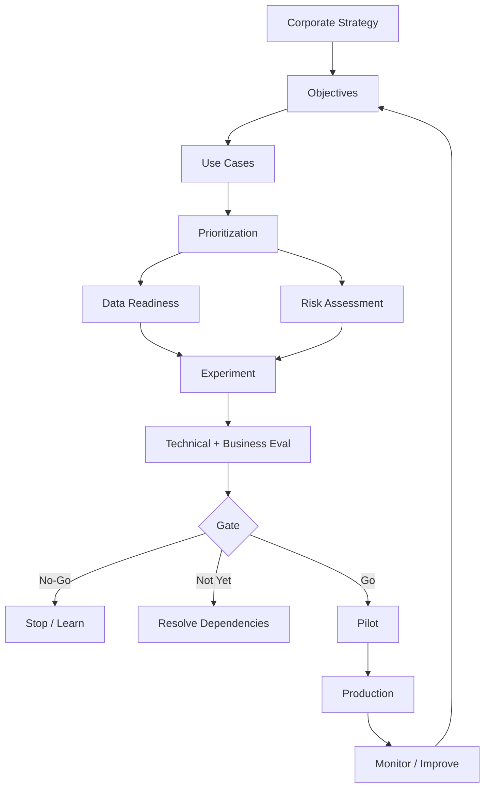

# 119. Governance proporcional

Principio:

```text
Controls ∝ Risk
```

No es una ecuación matemática, pero sí una guía de diseño.

---

# 120. Decision framework final

Para cada caso:

```text
1. Is the problem real?
2. Is GenAI appropriate?
3. Is value measurable?
4. Are data ready?
5. Is risk acceptable?
6. Can we operate it?
7. Is there ownership?
```

Resultados:

```text
GO
NO-GO
NOT YET
```

`NOT YET` es especialmente útil cuando el caso es valioso pero faltan datos, controles, skills o dependencias.

---

# 121. Demo effect

Las demos de GenAI pueden impresionar fácilmente.

Riesgo:

```text
confundir wow con business case
```

Producción introduce:

- edge cases;
- malicious input;
- latency;
- outages;
- data changes;
- user behavior.

---

# 122. Niveles de madurez estratégica

## Level 1 — Experimentation

PoCs dispersos.

## Level 2 — Repeatability

Patrones reutilizables.

## Level 3 — Governance

Portfolio y controles.

## Level 4 — Scale

Platform capabilities.

## Level 5 — Optimization

Métricas y mejora continua.

No saltar directamente a una plataforma empresarial de agentes sin haber construido evaluación y gobernanza.

---

# 123. Preguntas para dirección

- ¿qué objetivo soporta?;
- ¿qué valor esperamos?;
- ¿qué riesgo crea?;
- ¿quién responde si falla?;
- ¿cómo mediremos?;
- ¿cuándo paramos?

---

# 124. Preguntas para ingeniería

- ¿qué datos?;
- ¿qué modelo?;
- ¿qué eval?;
- ¿qué failure modes?;
- ¿qué fallback?;
- ¿qué observability?

---

# 125. Preguntas para risk/legal

- ¿qué población?;
- ¿qué decisiones?;
- ¿qué datos?;
- ¿qué transparencia?;
- ¿qué rol regulatorio?

---

# 126. Preguntas para usuarios

- ¿qué parte es lenta?;
- ¿qué output sería útil?;
- ¿qué errores son graves?;
- ¿cuándo confiarías?;
- ¿qué evidencia necesitas?

---

# 127. Strategy workshop

Un workshop útil debería producir:

1. problem list;
2. use case cards;
3. prioritization;
4. top candidates;
5. risks;
6. experiments.

Cada PoC debería formular una hipótesis:

```text
We believe...
for...
will improve...
measured by...
```

Ejemplo:

```text
We believe RAG search with citations
for operations engineers
will reduce time-to-authoritative-procedure,
measured by median task time and error rate.
```

---

# 128. Hipótesis técnica vs de negocio

Hipótesis técnica:

```text
semantic + lexical retrieval
will achieve Hit Rate@3 >= 0.90
```

Hipótesis de negocio:

```text
better retrieval
will reduce escalation rate
```

No son lo mismo.

---

# 129. Final strategic architecture



---

# 130. Checklist de oportunidad

- [ ] problema específico;
- [ ] usuario;
- [ ] frecuencia/volumen;
- [ ] baseline;
- [ ] alternativa no-IA evaluada;
- [ ] valor potencial;
- [ ] owner.

---

# 131. Checklist SMART

- [ ] específico;
- [ ] medible;
- [ ] baseline;
- [ ] target;
- [ ] fecha;
- [ ] counter-metrics.

---

# 132. Checklist de datos

- [ ] fuentes identificadas;
- [ ] owner;
- [ ] permisos;
- [ ] classification;
- [ ] calidad;
- [ ] representatividad;
- [ ] freshness;
- [ ] lineage;
- [ ] retention.

---

# 133. Checklist de riesgo

- [ ] technical;
- [ ] security;
- [ ] privacy;
- [ ] legal;
- [ ] ethics;
- [ ] reputational;
- [ ] operational;
- [ ] human impact.

---

# 134. Checklist de governance

- [ ] system inventory;
- [ ] product owner;
- [ ] technical owner;
- [ ] risk owner;
- [ ] data owner;
- [ ] policies;
- [ ] approval gates;
- [ ] audit evidence.

---

# 135. Checklist de PoC

- [ ] hypothesis;
- [ ] representative data;
- [ ] eval set;
- [ ] metrics;
- [ ] cost measurement;
- [ ] risk review;
- [ ] stop criteria.

---

# 136. Checklist de pilot

- [ ] user group;
- [ ] baseline;
- [ ] support;
- [ ] monitoring;
- [ ] incident process;
- [ ] feedback;
- [ ] rollback.

---

# 137. Checklist de producción

- [ ] SLO;
- [ ] security;
- [ ] legal/data approval;
- [ ] eval regression;
- [ ] observability;
- [ ] model/index versioning;
- [ ] change process;
- [ ] business continuity;
- [ ] training.

---

# 138. Preguntas de revisión

1. ¿Por qué debemos analizar tareas y no solo procesos completos?
2. ¿Qué diferencia hay entre technology push y problem pull?
3. ¿Cuándo usarías automatización tradicional en lugar de GenAI?
4. ¿Qué es una Use Case Card?
5. ¿Por qué la baseline es necesaria?
6. ¿Qué diferencia hay entre métrica de modelo y de negocio?
7. ¿Qué son counter-metrics?
8. ¿Cómo formularías un objetivo SMART?
9. ¿Por qué adoption no equivale a value?
10. ¿Qué dimensiones usarías para priorizar casos?
11. ¿Por qué un score no sustituye el juicio?
12. ¿Qué es data readiness?
13. ¿Qué diferencia existe entre calidad y representatividad?
14. ¿Por qué freshness importa especialmente en RAG?
15. ¿Cuándo preferirías RAG a fine-tuning?
16. ¿Qué significa data minimization?
17. ¿Qué es data lineage?
18. ¿Qué diferencia hay entre governance y compliance?
19. ¿Cuáles son las cuatro funciones del NIST AI RMF?
20. ¿Qué papel puede desempeñar ISO/IEC 42001?
21. ¿Qué es un registro de sistemas de IA?
22. ¿Qué diferencia existe entre inherent y residual risk?
23. ¿Qué categorías de riesgo evaluarías?
24. ¿Por qué prompt injection no se soluciona solo con un prompt?
25. ¿Qué significa progressive autonomy?
26. ¿Qué es automation bias?
27. ¿Qué es un stage gate?
28. ¿Qué diferencia hay entre prototype, PoC y pilot?
29. ¿Qué es un stop criterion?
30. ¿Por qué un PoC que se detiene puede considerarse exitoso?
31. ¿Qué entra en el TCO?
32. ¿Qué diferencia hay entre cost/request y cost/task?
33. ¿Cómo evaluarías build vs buy?
34. ¿Qué es risk-adjusted ROI?
35. ¿Por qué conviene usar escenarios?
36. ¿Qué es graceful degradation?
37. ¿Qué es un kill switch?
38. ¿Qué significa Go / No-Go / Not Yet?
39. ¿Cómo aplicarías M07 a Enterprise GenAI Assistant?
40. ¿Qué evidencias exigirías antes de producción?

---

# 139. Glosario

**AI Management System (AIMS/SGIA)**  
Sistema de gestión organizativo para establecer políticas, objetivos, procesos y mejora continua alrededor del desarrollo/uso de IA.

**AI Portfolio**  
Conjunto de iniciativas de IA gestionadas de manera coordinada.

**AI Risk Register**  
Registro estructurado de riesgos, owners, controles y riesgo residual.

**Automation Bias**  
Tendencia a confiar excesivamente en recomendaciones automáticas.

**Baseline**  
Medida del proceso antes de introducir la solución.

**Build vs Buy**  
Decisión sobre desarrollar, adquirir o ensamblar una capacidad.

**Counter-metric**  
Métrica diseñada para detectar efectos negativos de optimizar el KPI principal.

**Data Lineage**  
Trazabilidad del origen y transformaciones de los datos.

**Data Readiness**  
Grado en que los datos están disponibles, permitidos, curados y adecuados para el caso.

**Gate**  
Punto formal de decisión entre fases.

**Governance**  
Sistema de roles, políticas y decisiones que controla cómo se desarrolla y utiliza IA.

**Human-in-the-Loop**  
Patrón donde una persona participa en revisión/aprobación dentro del workflow.

**Inherent Risk**  
Riesgo antes de aplicar controles.

**North Star Metric**  
Métrica principal que representa el resultado que se pretende mejorar.

**Pilot**  
Prueba con usuarios/proceso reales y alcance limitado para validar valor y operación.

**PoC**  
Prueba de concepto orientada a validar viabilidad bajo condiciones representativas.

**Problem Pull**  
Innovación iniciada desde un problema real.

**Product Owner**  
Responsable del problema, usuario y valor del producto.

**Prototype**  
Implementación temprana para validar una hipótesis técnica.

**Residual Risk**  
Riesgo que permanece después de controles.

**Risk Owner**  
Persona responsable de gestionar/aceptar un riesgo.

**SMART**  
Specific, Measurable, Achievable, Relevant, Time-bound.

**Stage Gate**  
Modelo de fases separadas por decisiones explícitas de continuar o detener.

**Technology Push**  
Innovación iniciada desde una tecnología a la que se busca aplicación.

**TCO**  
Total Cost of Ownership.

**Use Case Card**  
Ficha estructurada que documenta problema, usuarios, datos, valor, riesgos, métricas y ownership.

---

# 140. Ideas clave que deben quedar al terminar M07

1. GenAI debe empezar por un problema, no por una herramienta.
2. La tarea es una mejor unidad de análisis que el proceso completo.
3. Automatización determinista sigue siendo preferible para reglas conocidas.
4. Una idea no es un caso de uso hasta que tiene usuario, problema, baseline y owner.
5. SMART exige target, métrica y tiempo.
6. Métricas técnicas no sustituyen métricas de negocio.
7. Counter-metrics evitan optimizaciones peligrosas.
8. Data readiness puede bloquear un caso de alto valor.
9. RAG, fine-tuning y prompting resuelven problemas distintos.
10. Data minimization reduce coste y riesgo.
11. Governance debe incorporarse desde discovery.
12. NIST AI RMF ofrece un lenguaje de Govern, Map, Measure y Manage.
13. ISO/IEC 42001 aporta una perspectiva de sistema de gestión.
14. EU AI Act debe evaluarse por rol y caso de uso, no mediante una regla universal.
15. Riesgo residual, no riesgo inherente, soporta la decisión.
16. Human oversight debe diseñarse para tareas concretas.
17. Más autonomía requiere más controles.
18. Retrieval, models y providers necesitan versionado y trazabilidad.
19. Un PoC debe tener hipótesis y stop criteria.
20. Pilot significa usuarios y condiciones reales, no demo.
21. Producción requiere operación, monitorización y respuesta a incidentes.
22. TCO incluye personas, governance e integración.
23. Build vs buy es una decisión de estrategia, no de preferencia tecnológica.
24. GO, NO-GO y NOT-YET son tres resultados válidos.
25. El objetivo del roadmap es reducir incertidumbre fase a fase.

---
